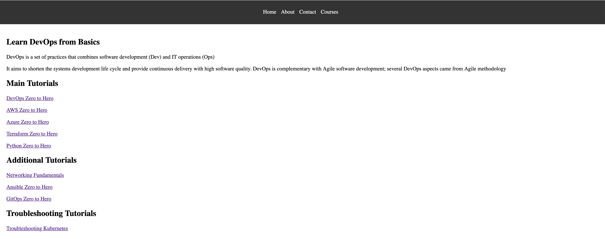

# Go Web Application

This is a simple website written in Golang. It uses the `net/http` package to serve HTTP requests.

## Running the server

To run the server, execute the following command:

```bash
go run main.go
```

The server will start on port 8080. You can access it by navigating to `http://localhost:8080/courses` in your web browser.

## To create EKS Cluster

Execute the following command:

```bash
eksctl create cluster --name go-webapp --region us-east-1 --nodes 2 --node-type t3.medium --managed
```

## To install Ingress controller

Execute the following command:

```bash
kubectl apply -f https://raw.githubusercontent.com/kubernetes/ingress-nginx/controller-v1.14.2/deploy/static/provider/aws/deploy.yaml
```
## Looks like this




